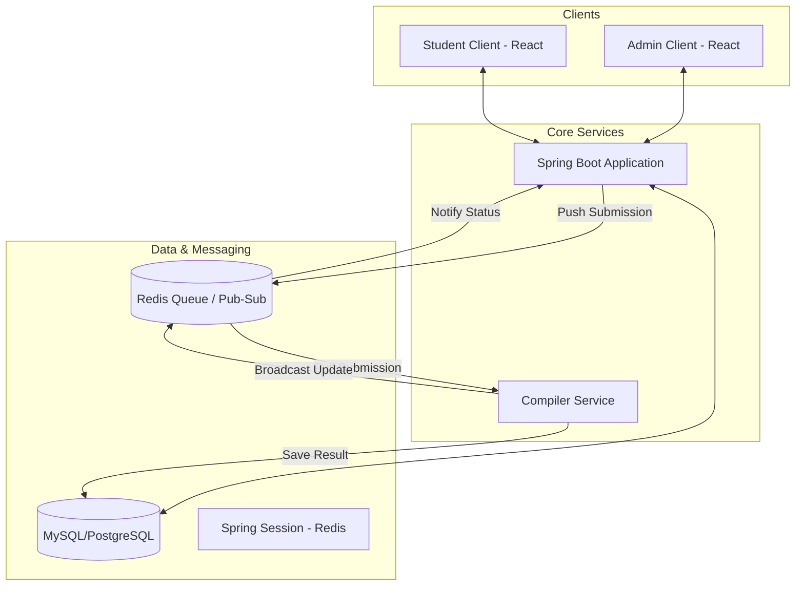

# iitj-coder Architecture

iitj-coder is a microservices-based coding assignment evaluation platform designed to handle asynchronous code execution and automated grading.

## High-Level Design (HLD)

The system consists of several decoupled services that communicate through a mix of REST APIs and messaging queues.

## Microservices Overview

### 1. Spring Boot Main Application (`/springboot`)
- **Responsibility**: Serving as the central API gateway and business logic layer.
- **Authentication**: Uses **Spring Session-based authentication** (backed by Redis) for students and admins.
- **Credential Management**: Admins generate student credentials (username/password) which are stored and used for secure access.
- **Submission Producer**: When a user submits code, this service validates the request, persists the submission record in the database, and publishes a JSON task to the Redis queue (`submissions` list).

### 2. Compiler Service (`/compiler-service`)
- **Responsibility**: Scalable, isolated code execution.
- **Async Processing**: A background `SubmissionConsumer` thread pulls tasks from Redis.
- **Execution Engine**: Uses **Docker** to run student code in isolated containers with resource limits (CPU, RAM, Time).
- **Hardcoded Logic**: Currently specialized for C++ (`g++`) to ensure high performance and consistency for competitive coding assignments.
- **Result Publisher**: Once execution is complete, it updates the database and publishes a status update to a Redis Pub/Sub channel (`submission_updates`).

### 3. Clients
- **Student Client (`/student-client`)**: React interface for viewing questions, writing code, and tracking submission history.
- **Admin Client (`/admin-client`)**: Interface for question creation, credential generation, and overall system monitoring.

## Key Design Choices

### Asynchronous Workflow
Code execution is a resource-heavy and slow operation. To prevent blocking the main API thread:
1. The student receives an immediate `202 Accepted` response.
2. The code is queued in Redis.
3. The `compiler-service` processes it at its own pace.
4. The UI reflects the status change (PENDING -> PROCESSING -> ACCEPTED/FAILED) via live updates.

### Redis as a Backbone
Redis serves three critical roles:
1. **Task Queue**: Reliable distribution of code execution tasks.
2. **Session Store**: Distributed session management allowing the API to scale horizontally.
3. **Pub/Sub**: Facilitating real-time updates from background workers back to the API layer/clients.

### Isolated Worker Threads
The `compiler-service` uses a dedicated `ExecutorService` with a fixed thread pool to manage its internal worker threads. This ensures that a single long-running or resource-intensive submission does not crash the entire consumer.

### Dockerized Sandbox
Each submission runs in a fresh Docker container. This provides:
- **Security**: Prevents student code from accessing the host machine.
- **Resource Control**: Strictly enforces memory and time limits.
- **Consistency**: The environment is identical for every run.

## Authentication Workflow
1. **Admin Action**: Admin provides a student email via `/admin/generate-credentials`.
2. **Credential Storage**: A random password is generated, hashed, and stored in the database.
3. **Student Login**: Student authenticates. Upon success, a session ID is stored in Redis.
4. **Authorized Requests**: Every subsequent request is verified against the session in Redis, ensuring secure and stateless-like scaling while maintaining a stateful user experience.
